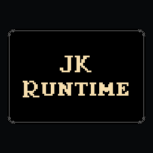
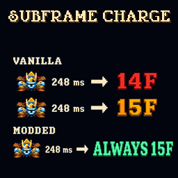
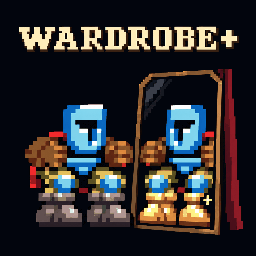

# Jump King Mods

Gameplay, camera, replay and mapping mods for Jump King, with a shared runtime
and tools for building and testing them.

<p>
  
  
  
  
</p>

See the [mod catalog](mods/README.md) for features, dependencies and installation
instructions. Install JK Runtime when a mod lists it as a dependency.

## Build

Use Windows with Jump King installed, Windows PowerShell, the .NET Framework
C# compiler and Python 3.10 or later. Optional asset tools use the packages in
`requirements-dev.txt`.
Use a short checkout path: some .NET Framework tests inherit Windows' 260-character
path limit.

```powershell
python -m pip install -r requirements-dev.txt
.\scripts\check-mods.ps1 -Mod subframe-charge
```

The default game path is Steam's `steamapps/common/Jump King` under
`C:\Program Files (x86)`. Pass `-GameDir` for another installation.
Packages go to `build/<mod-id>/UPLOAD_TO_WORKSHOP`. Building does not install them.

## Development

- [Contributing](CONTRIBUTING.md)
- [Checks and test tiers](docs/testing.md)
- [JK Runtime SDK](mods/jk-runtime/docs/index.md)
- [Mapping authoring guide](mods/mega-mapping-expansion/docs/authoring.md)
- [Credits and third-party notices](CREDITS.md)

JKForge, a separate map editor and toolchain, is in development.
