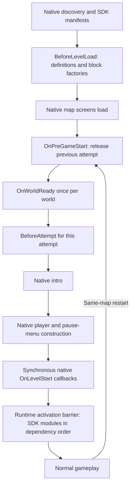

# Loading, activation and ownership

For map requirements, opt-in suspension and mechanic restrictions, see
[Map policy](map-policy.md). These rules are checked before map callbacks and
dependency preparation; they never rewrite saved user settings.

Use attributes in `JKRuntime.Modules` in a packaged feature. Do not put a second
native `JumpKingMod` entry in its implementation. The generated shell supplies
native discovery and forwards calls to PackageHost.

## Normal order

The diagram groups world/attempt preparation for readability. In implementation,
Runtime visits each accepted package in dependency order and runs that package's
world callback if needed, then its attempt callback. There is no global barrier
between all world callbacks and all attempt callbacks. Preparation cannot resolve
or publish gameplay capabilities; ordering alone does not make those available.

SDK `OnLevelStart` runs through the activation barrier, not directly at the
native mod's discovery position. Providers install/start before consumers. There
is no global "install everyone, then start everyone" pass. Dependencies and
`Before`/`After` order only Runtime participants, not foreign Harmony patches.

| Callback | Required signature | Intended work |
| --- | --- | --- |
| `BeforeLevelLoad` | `public static void Method()` | Register definitions/factories required by native map loading |
| `OnWorldReady` | `public static void Method(RuntimeScope scope)` | Prepare reusable loaded-world resources |
| `BeforeAttempt` | `public static void Method(RuntimeScope scope)` | Prepare fresh settings/file-dependent attempt data |
| `OnLevelStart` | `public static void Method(ModuleContext context)` or no arguments | Attach player behavior, publish services, subscribe to gameplay |
| `OnLevelEnd` | `public static void Method()` | Package's native level-end notification |
| `OnLevelUnload` | `public static void Method()` | Package cleanup, including rollback of a partial start |
| Menu setting attributes | `public static ConcreteMenuItem Method(object factory, GuiFormat format)` | Construct a lightweight menu item |

Each lifecycle attribute selects at most one method on the entry class. Menu
settings may have multiple attributed methods. Keep concrete menu return types
so discovery can classify them without running arbitrary code.

`BeforeLevelLoad` definitions run in ordinal package-ID order, not capability
dependency order. Its exception marks the package failed for the process; an
attempt restart does not clear it. `OnLevelEnd` visits active packages in reverse
resolved order and aggregates callback failures. It is a completion notification,
not a substitute for scoped cleanup on restart/unload. Menu factories may still
exist while the gameplay module is inactive; never assume an active player there.

## Lifetime choice

| Owner | Starts | Ends | Suitable resources |
| --- | --- | --- | --- |
| Process registration | Explicit declaration | Explicit process registration disposal while inactive | Module definitions, stable binding definitions |
| World `RuntimeScope` | First successful world preparation | World exit/replacement | Decoded audio, immutable map metadata |
| Attempt `RuntimeScope` | Each attempt preparation | Restart, cancellation or exit | Fresh file reads, settings-dependent plans |
| `ModuleContext` | Actual module activation | Deactivation or partial-start rollback | Player controllers, capability publications, subscriptions |
| Page `RuntimeScope` | `ScopedUiPage` opens | Close or failed open | Page-local registrations, drag/input ownership |
| Explicit operation lease | Acquire | Dispose/cancellation | Component suspension, clock override, temporary simulation |

Use `scope.Own(resource)` / `scope.Defer(cleanup)` for preparation and
`context.Track(resource)` for activation. Register cleanup before the next step
that can fail. Clear static references when their owner ends. A controller may
borrow a world asset; it must not dispose it at the end of an attempt.

`RuntimeScope` attempts releases in reverse order, removes successful releases,
and retains failed ones for retry. It is idempotent after success, rejects adding
resources once closure begins, and is not thread-safe. Its bookkeeping does not
make an underlying resource safe for disposal on another thread.

`ModuleContext.Track` is a different owner: it wraps resources for diagnostics,
attempts every reverse release, reports failures and closes the context. It does
not expose `RuntimeScope`'s retryable release list to the consumer. Incomplete
module cleanup blocks safe reactivation; preserve the error and restart the
process after correcting the cause. A resource that needs retry internally must
retain its own failed ownership rather than assuming every owner retries it.

## Dependencies and failure

`Requires = new[] { "service.id:1:0" }` requires major 1 and at least minor 0;
`:optional` permits absence but still establishes order for a compatible provider.
Publish only a declared service, then resolve it during activation with
`context.Require<T>()` / `TryGetCapability`. An optional service needs an explicit
absence path. Unknown/missing required services, conflicting claims and cycles
reject affected modules and their required dependents. Unrelated modules continue.

All SDK packages implicitly require `jk.ui:1:0`. `RuntimeApi.Supports(...)`
advertises a Runtime feature; it does not test another mod's presence or a native
game contract. Use the declared capability path for that dependency.

Preparation failure unwinds its partial scope and prevents the package's
activation for that attempt. A later attempt can retry. Successful world
preparation survives an attempt-only failure. Activation failure releases tracked
resources and calls the package unload hook; make that hook tolerate partial
initialization. Do not rely on a successful `OnLevelStart` before cleanup runs.

Runtime deactivates modules before releasing preparation. Cancellation of an
intro releases attempt resources even if no player/controller was attached.
World exit also releases world resources. A failed cleanup remains an error;
do not overwrite references to failed owners or claim the world was restored.

## Fallback and boundaries

Early preparation uses the existing single Harmony engine at `OnPreGameStart`.
If that hook is unavailable, Runtime prepares synchronously before activation.
Correctness is preserved, but the early-loading performance benefit is absent.
A previous player reference may still exist during either path: preparation must
not use it. Do not install another private startup hook to bypass this contract.

Runtime does not move work out of a mod's `Update`, constructor or menu callback.
See [preparation](preparation.md) for placement rules and
[testing](testing-and-release.md) for cold/restart/cancel/world-switch acceptance.
